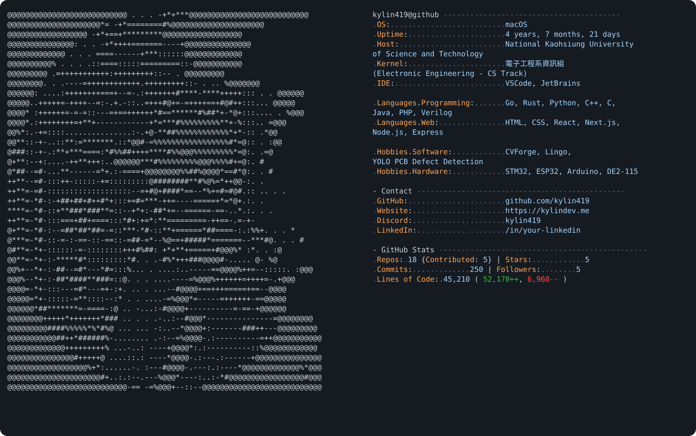

  

<pre>
────────────────────────────────────────────────────────────────────────────────────────

kylin419@github:~$ ls

projects/
skills/
about.txt
contact.txt

────────────────────────────────────────────────────────────────────────────────────────

kylin419@github:~$ cat projects

• CVForge
  High-performance image processing CLI written in Go.

• Lingo
  Discord productivity bot focused on collaboration and automation.

• AOI PCB Detection
  YOLO-based PCB defect detection on Jetson Orin Nano.

────────────────────────────────────────────────────────────────────────────────────────

kylin419@github:~$ cat skills

Programming Languages

  C
  C++
  Go
  Rust
  Python
  JavaScript
  Java
  PHP
  Verilog

Computer Vision

  OpenCV
  PyTorch
  TensorFlow

Embedded

  STM32
  ESP32
  Arduino

Backend

  Go
  Node.js
  Express
  PostgreSQL

────────────────────────────────────────────────────────────────────────────────────────

kylin419@github:~$ cat about.txt

Name        : Kylin

School      : National Kaohsiung University of Science and Technology

Department  : Electronic Engineering
              (Computer Science Track)

Focus

  • Computer Vision
  • Machine Learning
  • Embedded Systems
  • Backend Engineering
  • Robotics

────────────────────────────────────────────────────────────────────────────────────────

kylin419@github:~$ git status

On branch main

Your branch is up to date.

nothing to commit, working tree clean

────────────────────────────────────────────────────────────────────────────────────────

kylin419@github:~$ uname -a

Developer focused on building practical AI systems
from embedded hardware to backend services.

────────────────────────────────────────────────────────────────────────────────────────

kylin419@github:~$ cat contact.txt

GitHub      github.com/kylin419

Website     https://kylindev.me

Discord     kylin419

LinkedIn    /in/your-linkedin

────────────────────────────────────────────────────────────────────────────────────────

kylin419@github:~$ echo $MOTD

Building intelligent systems from embedded hardware to AI.

────────────────────────────────────────────────────────────────────────────────────────

kylin419@github:~$ █

</pre>
